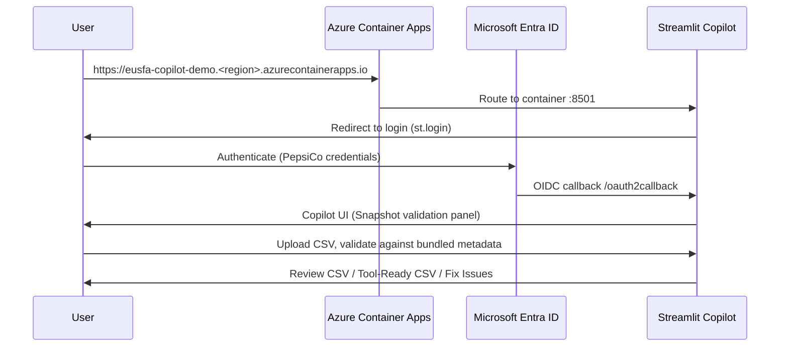

# Phase 1 — Leadership Demo Deployment (Azure Container Apps)

Deploy the Europe SFA Data Load Copilot as an Entra ID–protected Streamlit app on Azure Container Apps (ACA), using a **read-only bundled EUSFA metadata snapshot** (no Salesforce OAuth in Phase 1).

## Prerequisites checklist

| Item | Owner |
|------|-------|
| Azure subscription (or resource group in PepsiCo tenant) | IT / Cloud team |
| Azure Container Registry (ACR) | IT / Cloud team |
| Container Apps Environment | IT / Cloud team |
| Entra ID app registration (OIDC for Streamlit) | Entra admin |
| User/group assignment to Entra app | Entra admin |
| Outbound HTTPS from ACA (Entra token endpoints) | Network / IT |

## 1. Build the metadata snapshot locally or in CI

```powershell
# From repo root — copies EUSFA SFDX metadata, writes SNAPSHOT_MANIFEST.json, runs audit
$env:EUSFA_SFDX_REPO_PATH = "C:\path\to\EUROPE_SFA"
.\scripts\bundle_metadata_snapshot.ps1
python scripts\audit_bundled_metadata.py
```

**What is bundled:** `sfdx-project.json` plus these folders under `force-app/main/default/`:
`globalValueSets`, `standardValueSets`, `objects`, `customMetadata`.

**What is excluded:** Apex classes, LWC, static resources, `.git` history, `.env`, credentials, private keys.

Record the `commit_hash` from `bundled_metadata/SNAPSHOT_MANIFEST.json` for change tracking.

## 2. Build and push the container image

```powershell
$ACR = "<acr-name>.azurecr.io"
$IMAGE = "$ACR/eusfa-data-load-copilot:demo-phase1"

az acr login --name <acr-name>
docker build -t $IMAGE .
docker push $IMAGE
```

The Dockerfile runs `audit_bundled_metadata.py` during build and fails if secrets or forbidden files are detected.

## 3. Entra ID app registration (OIDC)

Create an **App registration** in Microsoft Entra ID:

1. **Redirect URI (Web):** `https://<container-app-fqdn>/oauth2callback`
2. **Client secret:** create and store in Azure Key Vault (or ACA secret reference)
3. **Token configuration:** optional group claims for RBAC
4. **Enterprise applications → User assignment:** require assigned users only (recommended)

Copy values into `.streamlit/secrets.toml` (see `.streamlit/secrets.toml.example`):

```toml
[auth]
redirect_uri = "https://<fqdn>/oauth2callback"
cookie_secret = "<random-32+-char-string>"
client_id = "<app-client-id>"
client_secret = "<client-secret>"
server_metadata_url = "https://login.microsoftonline.com/<tenant-id>/v2.0/.well-known/openid-configuration"
```

Mount secrets via ACA **Secrets** + environment variable `STREAMLIT_SECRETS` or bind-mount at `/app/.streamlit/secrets.toml`.

## 4. Deploy Azure Container Apps

### Minimum Azure resources

| Resource | SKU / notes |
|----------|-------------|
| Resource group | e.g. `rg-eusfa-copilot-demo` |
| Azure Container Registry | Basic or Standard |
| Log Analytics workspace | Required by ACA environment |
| Container Apps Environment | Consumption or dedicated |
| Container App | 1 revision, 1–2 vCPU, 2 GiB RAM |
| (Optional) Key Vault | Store Entra client secret, cookie secret |

### Environment variables (Container App)

| Variable | Value |
|----------|-------|
| `DEPLOYMENT_MODE` | `demo` |
| `METADATA_MODE` | `bundled` |
| `BUNDLED_METADATA_PATH` | `/app/bundled_metadata` |
| `PORT` | `8501` |
| `SSO_DISABLED` | `false` (omit in production demo) |

### Ingress

- **External ingress:** enabled
- **Target port:** `8501`
- **Transport:** HTTP (TLS terminated at ACA)
- **Custom domain (optional):** map `eusfa-copilot.pepsico.com` via IT DNS

### Health probe

```yaml
# Example probe (Azure Portal or Bicep)
probe:
  - type: liveness
    httpGet:
      path: /  # Streamlit root; container also supports scripts/healthcheck.py
    initialDelaySeconds: 40
    periodSeconds: 30
```

For startup validation without HTTP, use exec probe:

```bash
python scripts/healthcheck.py
```

### Manual deploy (Azure CLI sketch)

```bash
az containerapp create \
  --name eusfa-copilot-demo \
  --resource-group rg-eusfa-copilot-demo \
  --environment <aca-env-name> \
  --image <acr>.azurecr.io/eusfa-data-load-copilot:demo-phase1 \
  --target-port 8501 \
  --ingress external \
  --cpu 1.0 --memory 2.0Gi \
  --env-vars DEPLOYMENT_MODE=demo METADATA_MODE=bundled BUNDLED_METADATA_PATH=/app/bundled_metadata \
  --registry-server <acr>.azurecr.io
```

## 5. Expected demo URL flow



1. User opens the ACA FQDN.
2. Streamlit `st.login()` redirects to Entra OIDC.
3. After successful login, user lands on the Copilot home page.
4. **Snapshot validation** panel shows bundled metadata health (no Git pull).
5. User runs the standard CSV validation workflow unchanged.

## 6. Steps requiring PepsiCo IT / Azure / Entra admin

| Step | Why IT is needed |
|------|------------------|
| ACR create + push permissions | Developers may not have subscription write access |
| ACA environment + VNet integration | Corporate network / private endpoints |
| Entra app registration + redirect URI approval | Tenant admin consent |
| Assign users/groups to enterprise app | Restrict demo to leadership audience |
| Key Vault + managed identity for secrets | Secret rotation policy |
| Custom domain + TLS certificate | DNS and corporate CA |
| EUSFA metadata repo read access for CI | Source snapshot in build pipeline |

## 7. Post-deploy verification

1. Unauthenticated request → redirects to Entra login (not anonymous app).
2. Login as assigned user → Copilot loads.
3. Metadata panel → **Metadata Snapshot Ready**, objects/fields counts > 0.
4. Upload `test_data/retail_promotion/RO_Promotion_Faulty_Validation_Test.csv` → validation runs.
5. `python scripts/healthcheck.py` inside container returns `HEALTHY`.

## 8. Updating the metadata snapshot

1. Run `bundle_metadata_snapshot.ps1` against a newer EUSFA commit.
2. Re-run audit script.
3. Build and push new image tag.
4. Deploy new ACA revision.
5. Update `SNAPSHOT_MANIFEST.json` commit hash in release notes.

---

# Phase 2 — Live Salesforce Metadata (document only)

**Not implemented in Phase 1.** Planned follow-up after leadership demo:

| Capability | Approach |
|------------|----------|
| Salesforce OAuth PKCE | User-delegated read-only metadata API |
| `LiveSalesforceMetadataProvider` | Implements `MetadataProvider` protocol |
| Encrypted token storage | Azure Key Vault or Redis with encryption at rest |
| Multi-replica session affinity | Redis-backed token + metadata cache |
| Replace bundled snapshot | `METADATA_MODE=live` env flag |
| Org picker / sandbox selector | Streamlit UI + Connected App per org |

Phase 2 deployment additions: Connected App in Salesforce, Redis Cache (Azure Cache for Redis), Key Vault references, updated Entra + Salesforce CORS/redirect URIs.

See [ROLLBACK_PLAN.md](./ROLLBACK_PLAN.md) if a deployment must be reverted.
